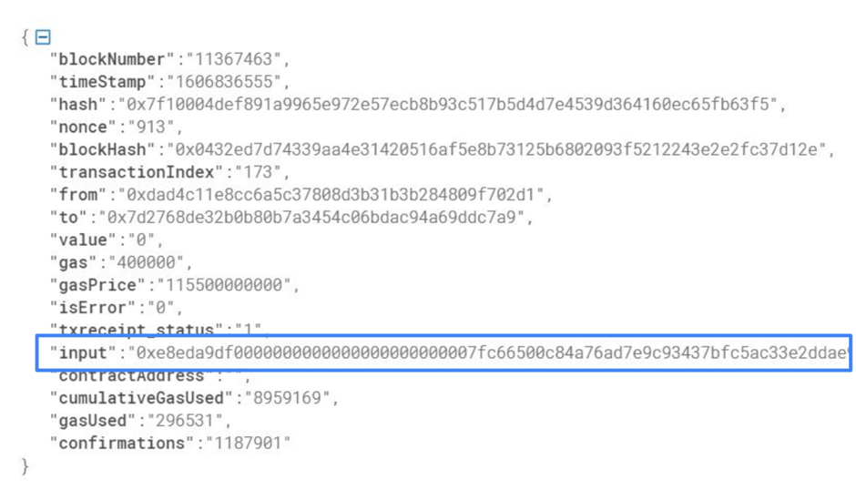
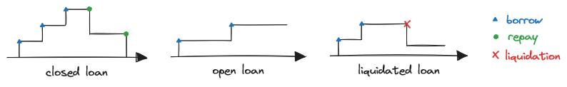
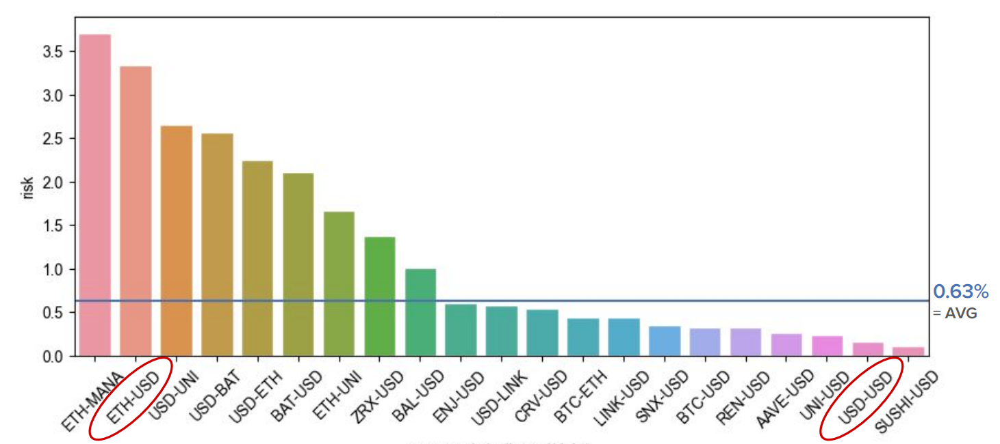
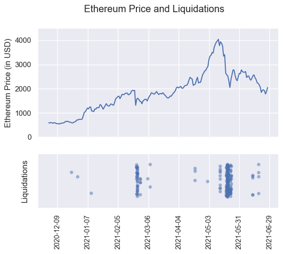

# Aave Liquidation Risk

Exploring interaction patterns and risks associated with borrowing cryptocurrencies on the [Aave V2 protocol](https://Aave.com).

Aave is a leading decentralized finance protocol running on the Ethereum blockchain (as of 2021). 
It is like a digital bank where you can deposit your cryptocurrencies and earn interest,
or borrow different cryptocurrencies.

## Findings

### How Aave works

The Aave V2 protocol consists of multiple smart contracts built on the Ethereum blockchain.
Users only interact with the *Lending Pool V2* smart contract:
* Depositing:
  * Users can `deposit` a cryptocurrency and earn interest. 
  * Users can `withdraw` their deposited cryptocurrencies at any time.
* Borrowing:
  * Users can also `borrow` cryptocurrencies, but have to pay interest.
  * Before borrowing, they must deposit a certain amount as collateral.
    The exact amount depends on the cryptocurrency.
    This ensures that users pay back and do not act maliciously.
  * Users can `repay` part of the borrowed assets any time.
* Liquidations:
  * Due to price changes of the deposited and borrowed cryptocurrencies, it might happen that they do not have enough collateral deposited.
  * If that is the case, other users can trigger a `liquidation call` and purchase up to 50% of the collateral at a discounted price.
  * This mechanism ensures that Aave does not lose money.

For more details, take a look at the [Aave V1 Whitepaper](https://github.com/Aave/Aave-protocol/blob/master/docs/Aave_Protocol_Whitepaper_v1_0.pdf) and [Aave V2 Whitepaper](https://github.com/aave/protocol-v2/blob/master/aave-v2-whitepaper.pdf).

### Data Gathering

Here is a short overview of the datasets used in this project:
* Aave Transactions:
  * 235,000 transactions from the Ethereum blockchain 
  * Smart contracts:
    * Lending Pool V2: `0x7d2768dE32b0b80b7a3454c06BdAc94A69DDc7A9` 
    * WETH Gateway: `0xcc9a0B7c43DC2a5F023Bb9b738E45B0Ef6B06E04`
  * Source: Etherscan API
* Aave ABI:
  * For decoding contract methods
  * Source: npm package @Aave/protocol-v2 and Etherscan API
* Price History:
  * For exploring correlation with asset prices
  * Source: Coinapi API
* Aave TVL History:
  * For general data exploration
  * Source: Defipulse API

The analysis covers data from December 1, 2020, to June 28, 2021.

### Data Analysis

#### Contract Events

First, let's take a look at the activities (contract events) happening on Aave.

For this, we take the transactions on the Ethereum blockchain involving the Aave smart contracts.
The specific method that each transaction triggers are encoded, as can be seen by the field `input` below: 



Decoding this input with the Aave V2 ABI, and counting the number of events yields the following result:

| Contract Event  | Count |
|-----------------|------:|
| deposit         | 93695 |
| withdraw        | 47445 |
| borrow          | 62417 |
| repay           | 29392 |
| liquidationCall |   249 |

Liquidations only make up a small number of all the interactions.
There are fewer repays than borrows.
This indicates that users borrow multiple times, and then repay these cryptocurrencies in one transaction.
To get more information about borrows & repays, we have to look at individual loans.

#### Loans

Next, let's look at individual loans.

We can estimate the loans by sequentially adding up the borrowed and subtracting the repaid amount.
If the amount reaches zero, we know the loan is fully repaid aka *closed*.
Else the loan is still *open*.
If at any time a liquidation occurs, we consider the loan as *liquidated*, and not open or closed.



We do this for each asset of each user (aka address), which yields the following: 

| Loan            | Count |
|-----------------|------:|
| open            | 11644 |
| closed          | 13565 |
| liquidated      |   159 |

We estimated 25368 loans in total.
The number of open and closed loans is similar, suggesting a relatively young protocol. 
The number of liquidated loans is still small. 
The share of liquidated loans is `0.63%`, allowing a basic estimate for liquidation risk.

#### Loans per Asset Pair

Next, we try to determine if certain asset pairs are more prone to liquidations than others.
An asset pair is composed of the cryptocurrencies as collateral and of the loan e.g. (ETH-USD).

Aave does not give us this information, thus we use a simple heuristic: 
If a user has a loan of asset x, we look at what assets y they have during that time as collateral.
Additionally, we grouped all stablecoins that represent USD together (e.g. DAI, USDC).


Here we see the number of loans without liquidations for certain asset pairs.
They seem to follow the power law, characterized by a few highly popular asset pairs and numerous less popular ones.
Most loans are in ETH-USD (collateral-debt). The 4th most popular is USD-USD.


Here we see the share of loans with liquidations. We also call this *asset pair risk*.
Loans with ETH-USD which were the most popular overall, 
also have one of the highest percentages of loans with liquidations, `~ 3.5%`,
which is about 1 in 28 loans.
While loans with USD-USD, which are also very popular, have a quite low share of being liquidated.
A possible reason for this trend could be that asset pairs with lower liquidations also have minimal price fluctuations (e.g. USD-USD).  

#### Correlation of liquidations and asset price

Next, let's look if liquidations correlate when the price of a cryptocurrency changes.
Due to time constraints, we just look at the price of ETH.



The price of Ethereum is shown in the upper chart, while a scatterplot of the liquidations is shown below.
There seem to be large clusters of liquidations occurring when the price drops are strong, indicating a correlation.

### Summary

We determined about 25k loans on the Aave V2 protocol.
About half of the loans are paid back, and the other half are still open.
Liquidations make up a relatively small number of all loans.
Some combinations of dept & collateral assets (asset pairs) are more popular than others, and some are more risky than others.
There seems to be a correlation between liquidations and the price of Ethereum, especially when the price drops strongly.

There is lots of potential for further research.
Exploring interactions on Aave in more depth, such as borrowing behavior, 
or including more data like the duration or number of loans in the analysis.
Additionally, it could be investigated if other lending protocols like Compound or Maker yield similar results.


## Reproduce

To reproduce our results, follow these steps:

1. **Install Dependencies**:

   Ensure that [Node](https://nodejs.org/en/) and [Python 3](https://www.python.org/downloads/) are installed on your machine.

   Install the JavaScript dependencies with:
   ```bash
   npm install
   ```
   Install the Python dependencies with:
   ```bash
   pip install -r requirements.txt
   ```
   *Note:* We additionally use Node, since it is easier to handle ABI related things with the libraries available in the node ecosystem.

2. **Set API Keys:**

   Get API keys from the following sources:
   - [Etherscan](https://docs.etherscan.io/getting-started/viewing-api-usage-statistics)
   - [Defipulse](https://data.defipulse.com)
   - [CoinAPI](https://docs.coinapi.io)
   
   Next, create a `.env` file at the project's root.
   The content of the file should look like `.env.sample` but with your API keys instead of the `xxxx`.

3. **Run the Scripts:**

   The code in the `/scripts` folder follows a pipeline with 4 phases:
   1. Download: Fetch necessary raw data.
   2. Parse: Speeds up processing by parsing some of the raw data.
   3. Evaluate: Analyzes data, generating project results (= heart of the project).
   4. Visualize: Creates plots based on result data.
   
   Simply run the scripts sequentially, starting with "download" scripts.
   Use commands like `node ./scripts/parse-lendings.js`, or `python ./scripts/evaluate.py`. 
   Some scripts might want you to specify the path to the input data.

4. **View Outputs:**

   The results from the scripts will be saved in the following folders:
   - `data/raw`: Contains raw downloaded data.
   - `data/parsed`: Contains the parsed data.
   - `reports`: Contains the final results.


## Lessons Learned

Here are some key takeaways from our project:

- Heuristics help! (sometimes the data you have is not enough)
- Decentralized finance is a complex field (involving intertwined smart contracts and lots of financial maths)
- There is much to learn with Data Science (how to approach the problem, best practices for data exploration/understanding, 
how to structure the code, validity of results, etc.)
- *Note:* In hindsight, this might seem obvious, and using jupyter notebooks would have been a good idea, but keep in mind that this was our first data science project.


## Credits

This project was created by two students as part of a lecture at the *Vienna University of Technology*.
